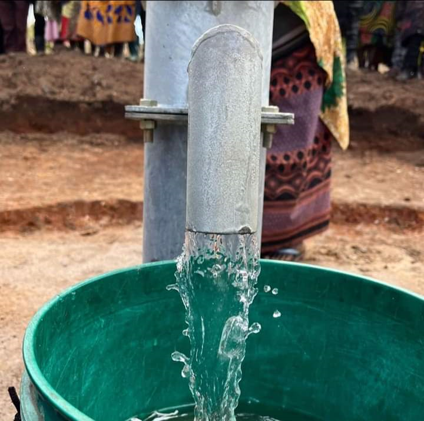

# Business Problem: Predicting the Condition of Water Wells in Tanzania

## **Introduction:**
This project aims to address the critical issue of providing clean water to the population of Tanzania, a developing country with over 59,000,000 people. Many existing waterpoints in the country are either in need of repair or have completely failed, leading to limited access to clean water. By building a classifier to predict the condition of water wells, this project aims to assist in prioritizing maintenance and repair efforts, ultimately ensuring a more reliable water supply for the population.

## **Business Goal:**
The primary objective of this project is to develop a predictive model that accurately classifies the condition of water wells in Tanzania. The model will provide actionable insights to prioritize repair and maintenance efforts, optimize resource allocation, and minimize downtime of waterpoints. By leveraging machine learning techniques, we aim to improve the efficiency and effectiveness of water supply management, leading to increased access to clean water for the population.

## **Data Collection:**
The dataset used for this project is was  provided as part of a competition. It contains information about various attributes related to water wells in Tanzania, such as the type of pump, installation date, and other relevant features. The dataset is labeled, meaning it includes the condition of each water well, classified into three categories: functional, functional needs repair, and non-functional.

The data collection process involved gathering information from diverse sources, including government reports, field surveys, and existing databases related to water supply infrastructure in Tanzania. To ensure the reliability and accuracy of the dataset, rigorous quality control measures were employed to verify the collected data against ground truth information.

## **Dataset Overview:**
The dataset consists of structured data in tabular format, containing a range of attributes for each water well. The following are some of the key features included in the dataset:

1. **Pump Type**: The type of pump installed in the water well.
2. **Installation Year**: The year in which the pump was installed.
3. **Waterpoint Location**: Geographical coordinates or other location identifiers.
4. **Water Quality**: Information about the quality and purity of the water source.
5. **Management**: The responsible entity or organization managing the waterpoint.
6. **Extraction Method**: The technique employed to extract water from the well.

The dataset is split into a training set and a test set. The training set was used to develop and train the predictive model, while the test set will be used for model evaluation and performance assessment. It was essential to maintain the integrity of the dataset and ensure its proper usage for reliable predictions.

## **Conclusion:**
By leveraging the model we built, We aim to assist water supply management authorities in Tanzania to prioritize maintenance and repair efforts. By predicting the condition of water wells, resources can be efficiently allocated, and proactive measures can be taken to prevent water shortages and ensure a more reliable and sustainable water supply for the population.

## **Recommendations:**
Based on the insights gained from this project, the following recommendations can be made to improve water supply management in Tanzania:

1. Prioritize Maintenance: Utilize the predictive model to prioritize maintenance efforts by identifying water wells that are likely to fail or require repairs in the near future. This proactive approach will help prevent water shortages and minimize downtime of waterpoints.

2. Optimize Resource Allocation: By accurately classifying the condition of water wells, resources can be allocated more effectively. Allocate maintenance and repair resources based on the predicted condition of each water well, ensuring that limited resources are utilized where they are most needed.

3. Monitor Water Quality: Continuously monitor and assess the quality of water from different water sources. Incorporate water quality data into the predictive model to identify potential issues with water quality and take appropriate actions to ensure access to clean and safe drinking water.

4. Collaborative Partnerships: Foster collaboration between government agencies, non-profit organizations, and local communities to improve water supply management. Encourage partnerships to share resources, knowledge, and best practices to address water-related challenges collectively